# Active Directory User and Group Management Lab

## Project Overview

This lab demonstrates the deployment and administration of Active Directory Domain Services (AD DS) using Windows Server 2022 in a VirtualBox environment.

The objective was to install Active Directory, create a new domain, configure user accounts and security groups, and verify group membership assignments using Active Directory Users and Computers (ADUC).

---

## Technologies Used

* Windows Server 2022
* Active Directory Domain Services (AD DS)
* Active Directory Users and Computers (ADUC)
* VirtualBox
* Windows Administration Tools

---

## Lab Objectives

* Install Windows Server 2022
* Deploy Active Directory Domain Services
* Create a new forest and domain
* Configure user accounts
* Create security groups
* Assign users to groups
* Verify Active Directory functionality

---

## Installation Process

### 1. Windows Server Installation

Selected Windows Server 2022 Standard Evaluation (Desktop Experience).

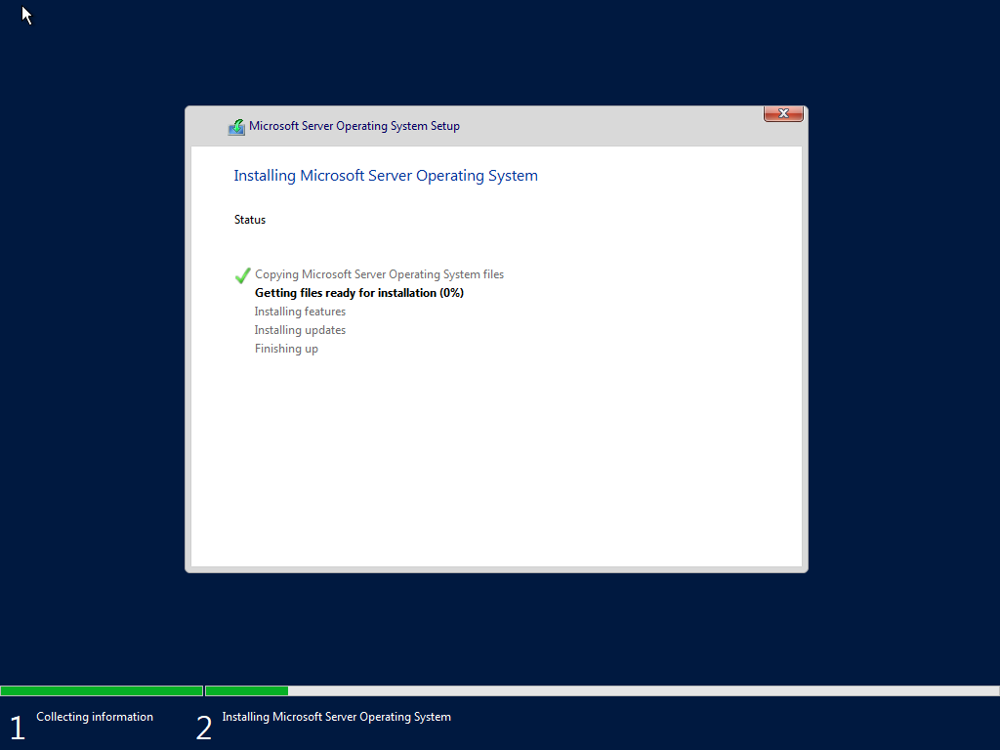

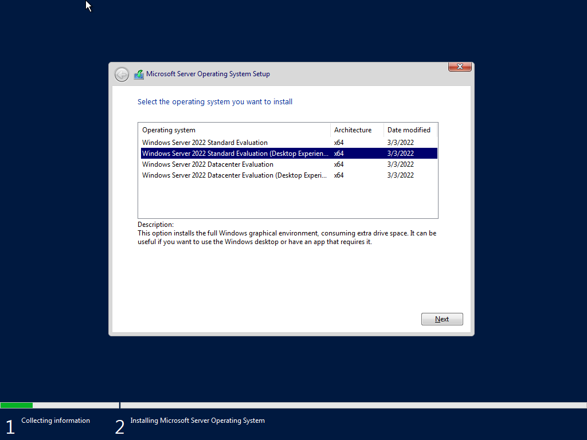

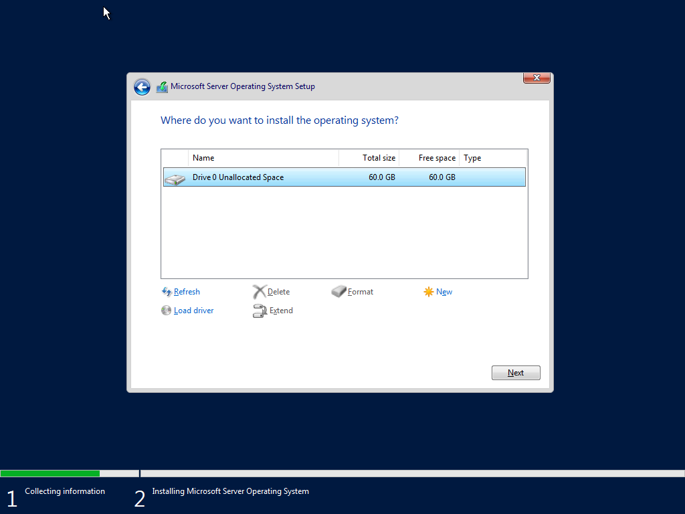

---

### 2. Active Directory Domain Services Installation

Installed the AD DS role and required management tools.

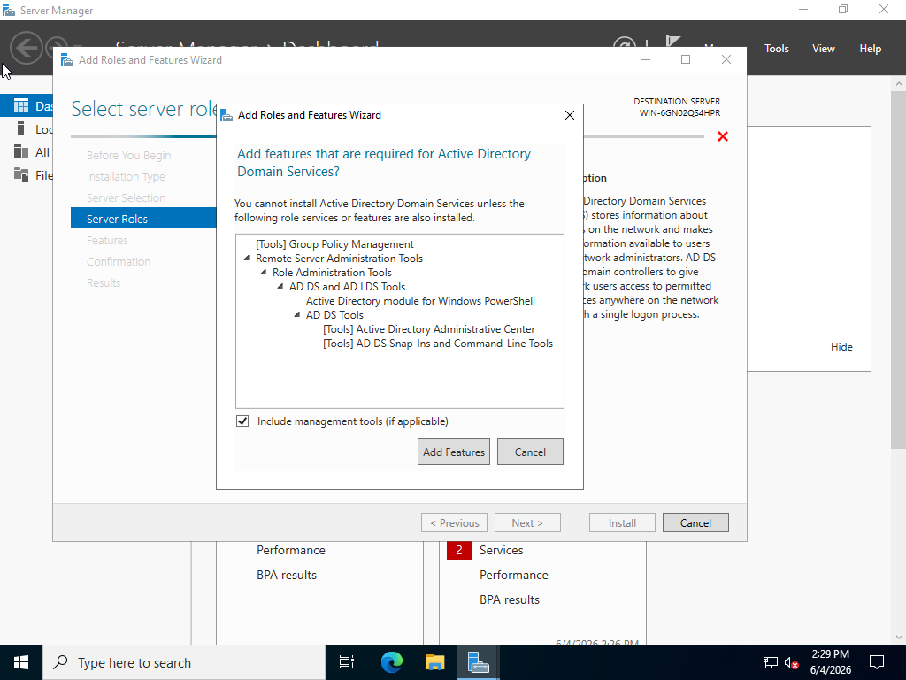

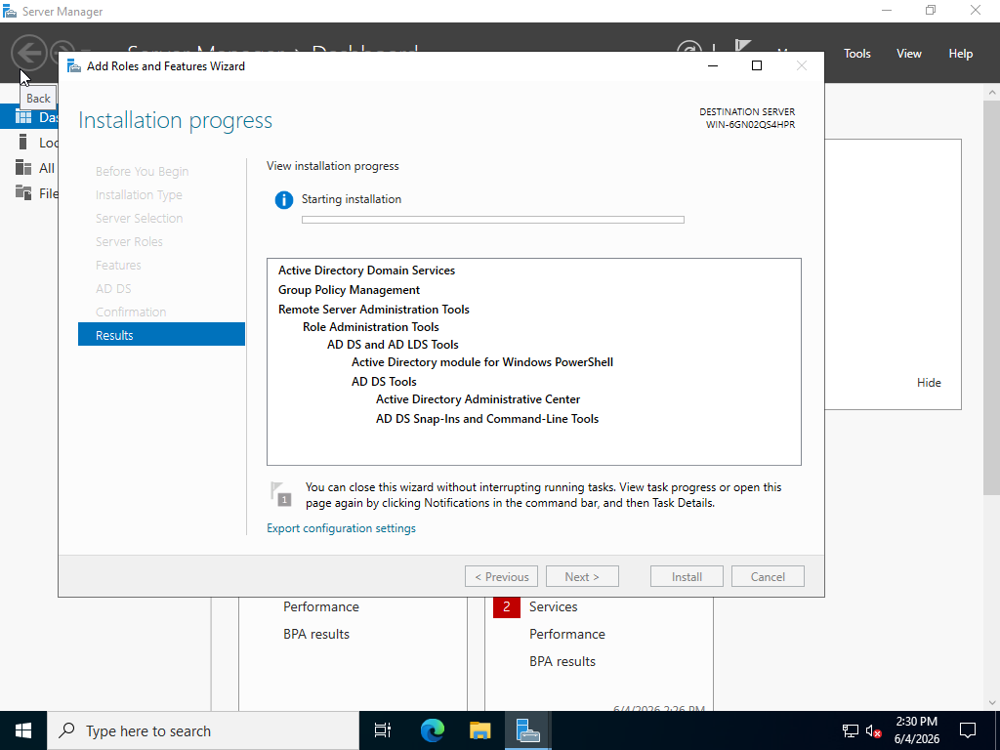

---

### 3. Domain Configuration

Created a new Active Directory forest and configured the root domain.

**Domain Name:** `lab.local`

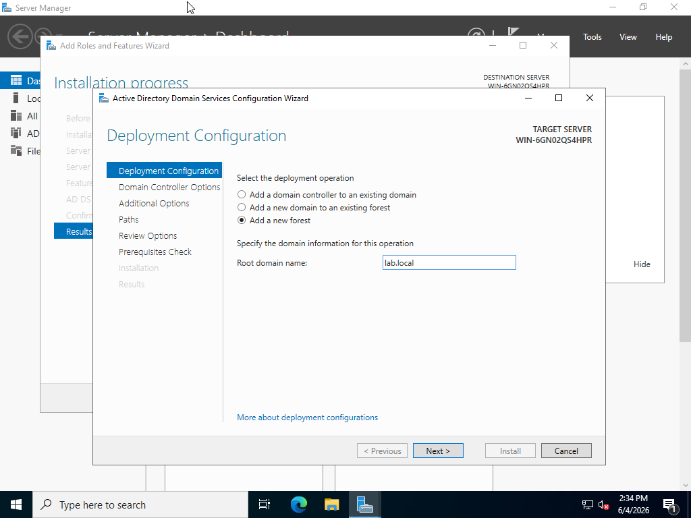

---

## User Management

Created several user accounts to simulate a small business environment.

### IT Administrator Account

* Username: ITAdmin

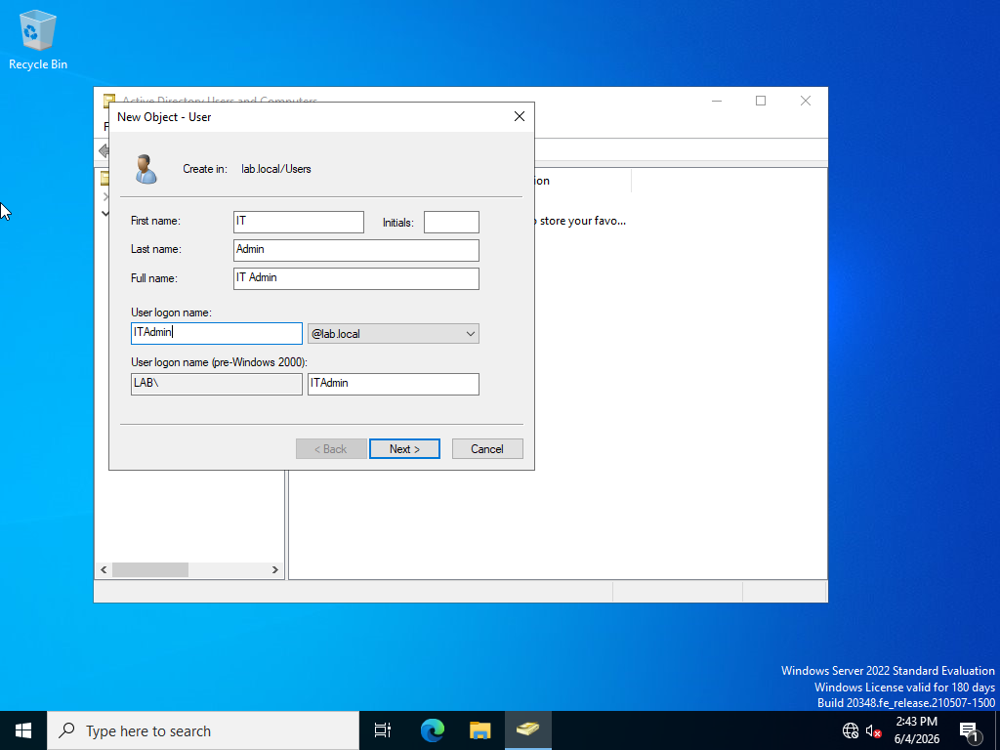

### Help Desk Account

* Username: HelpDesk

### Standard Test User

* Username: TestUser

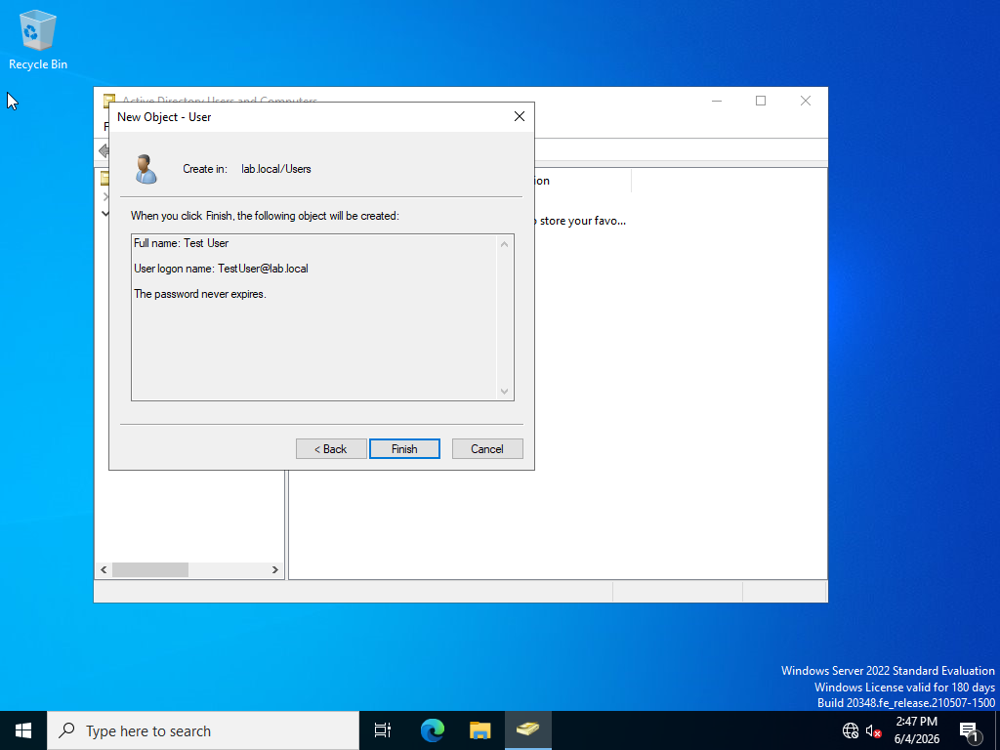

---

## Active Directory Administration

Verified all created users and groups within Active Directory Users and Computers.

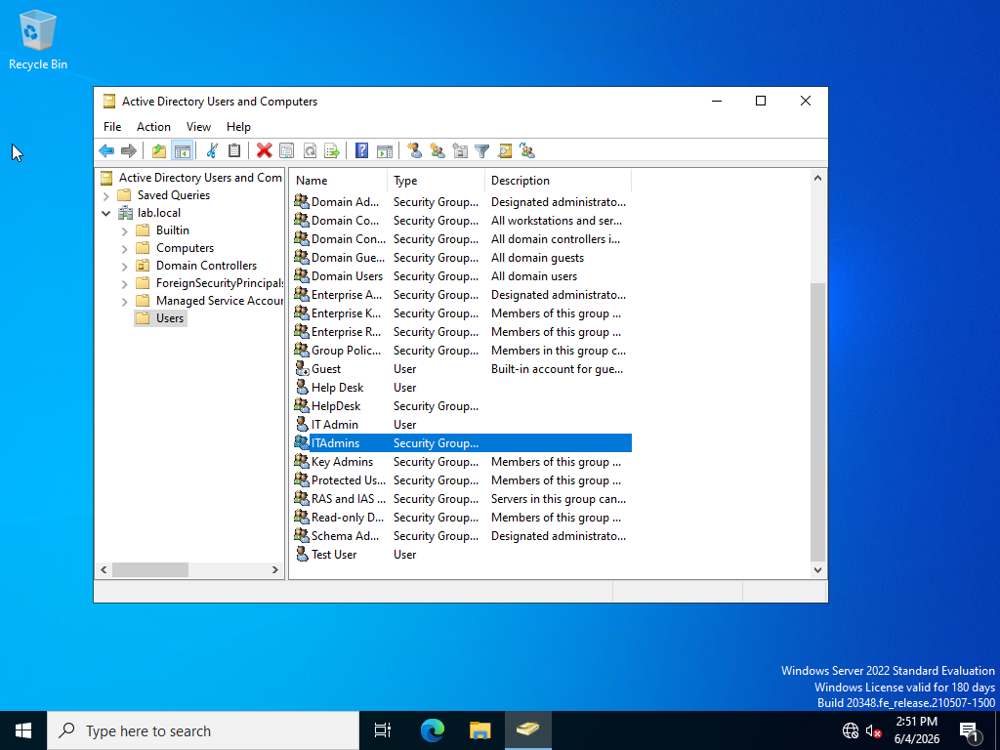

---

## Group Management

### ITAdmins Security Group

Added ITAdmin user to the ITAdmins group.

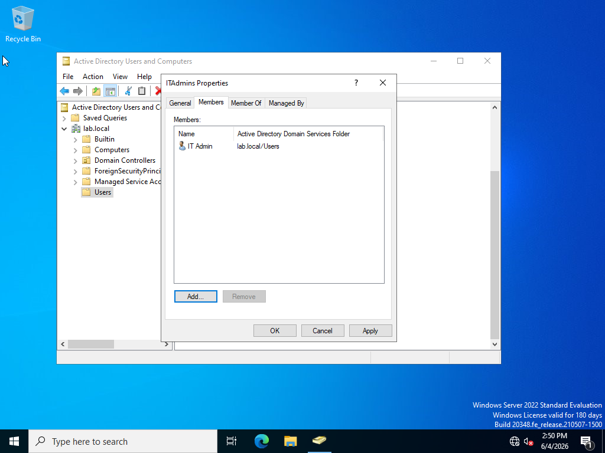

### HelpDesk Security Group

Added HelpDesk user to the HelpDesk security group.

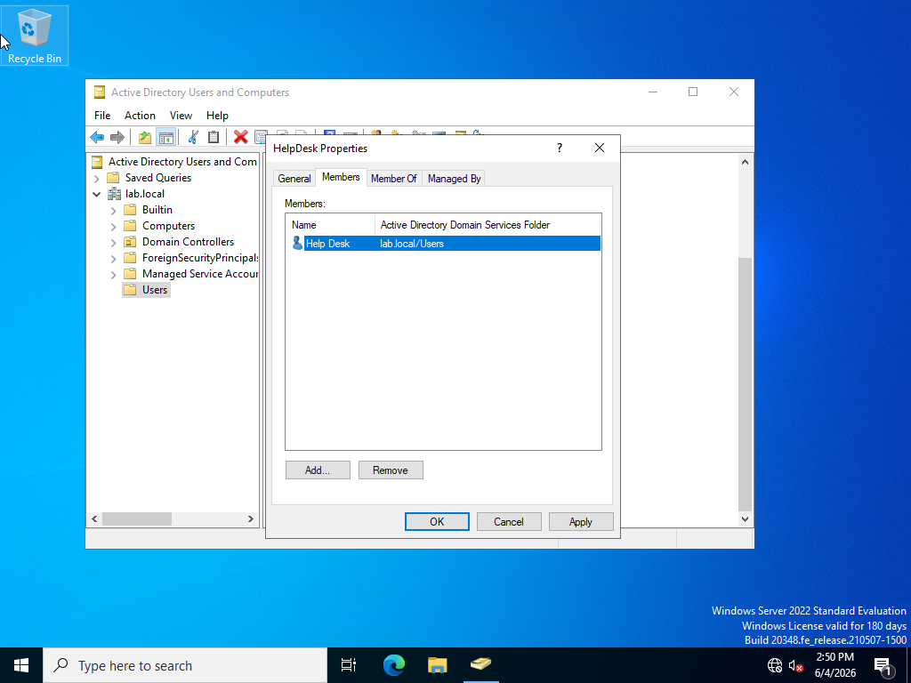

---

## Skills Demonstrated

* Active Directory Administration
* Domain Controller Deployment
* User Account Management
* Security Group Administration
* Identity and Access Management (IAM)
* Windows Server Management
* Microsoft Enterprise Environment Fundamentals
* Documentation and Technical Reporting

---

## Results

Successfully deployed a Windows Server 2022 Active Directory environment, created user accounts, configured security groups, and verified group memberships using Active Directory administrative tools.

This project demonstrates foundational system administration skills commonly used in Help Desk, Desktop Support, and Junior Systems Administrator roles.

---

## Author

**Dante Walker**

Aspiring IT Support / Help Desk Professional

GitHub Portfolio Project
